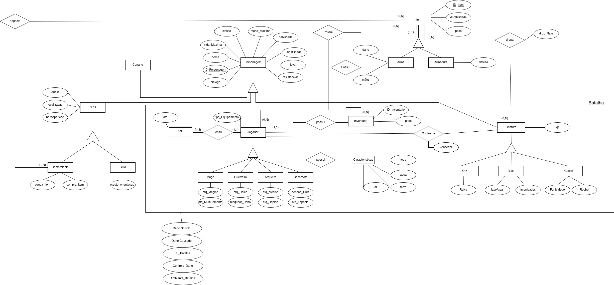

# DER - Diagrama Entidade Relacionamento
> O DER (Diagrama de Entidade-Relacionamento) é um modelo visual que representa as entidades de um sistema e os relacionamentos entre elas, sendo usado para planejar a estrutura de bancos de dados.

## DER - Senhor dos Aneis

  
Figura 1: DER Senhor dos Aneis

  
Fonte: Autores

## DER - Mapa do Jogo

  
Figura 2: DER Mapa

  
Fonte: Autores

## 🕰️ Histórico de Versão
| Data       | Versão | Descrição            | Autores                                                                                                                            |
|------------|--------|----------------------|------------------------------------------------------------------------------------------------------------------------------------|
| 02/04/2025 | 1.0    | Criação Docs DER | [Gabriel Esteves](https://github.com/GabrielMEsteves) e [Yan Luca Viana de Araújo Fontenele](https://github.com/yan-luca)|