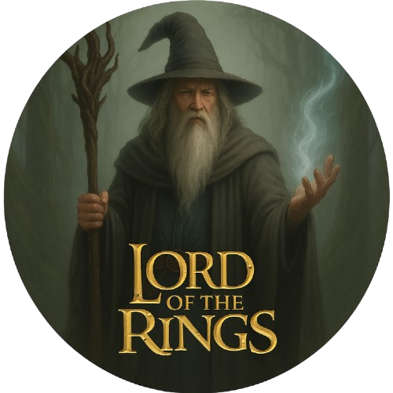

# Lord of The Rings Terminal Game

  
  
<b>Figura 1:</b> Capa oficial do Jogo

O **Lord of The Rings Terminal Game** é inspirado no universo de Senhor dos Aneis criado por J. R. R. Tolkien. Nosso objetivo é recriar a essência da série de filmes, com foco em mecânicas de exploração, gerenciamento e combate.

---

## Sobre o Projeto

Em **Lord of The Rings Terminal Game**, você assume o papel de um aventureiro, um hobbit que vive em paz na sua vila, porém, avido para viver novas aventuras e explorar a magnitude do mundo. Nosso projeto adapta essa experiência para o terminal, com funcionalidades como:

- **Exploração de masmorras**: Navegue pelas masmorras, enfrentando desafios e coletando itens valiosos.
- **Combate contra monstros**: Enfrente uma variedade de inimigos com diferentes habilidades e comportamentos.
- **Sistema de armas e armaduras**: Equipe-se com armas e armaduras que podem possuir diferentes efeitos.
- **Efeitos e habilidades especiais**: Utilize habilidades e efeitos únicos para derrotar inimigos e superar obstáculos.
- **Gerenciamento de inventário**: Organize os itens coletados durante as explorações e decida o que vender ou guardar.
- **Progressão do personagem**: Melhore as habilidades e desbloqueie novos equipamentos e funcionalidades.

A aplicação é desenvolvida em **Python**, com a lógica de dados estruturada em **PostgreSQL**, utilizando SQL puro para modelagem, triggers, views e controle de acesso.

---

# Contribuidores:

  <table>
    <tr>
      <td align="center"><a href="https://github.com/FelipeFreire-gf"> <b>Felipe das Neves</b></a> 202046102</td>
      <td align="center"><a href="https://github.com/GabrielMEsteves"> <b>Gabriel Felipe</b></a> 190106956</td>
      <td align="center"><a href="https://github.com/lucaaassb"> <b>Lucas Soares</b></a> 202017700</td>
      <td align="center"><a href="https://github.com/Fernandavazgit1"> <b>Fernanda Vaz</b></a> 221007715</td>
      <td align="center"><a href="https://github.com/yan-luca"> <b>Yan Luca</b></a> 211031889</td>
    </tr>
  </table>

## Estrutura do Projeto

O projeto está organizado em três ambientes principais:

- **`game/cli`**: Código da interface em terminal (Python), responsável pela interação do usuário com o sistema.
- **`game/sql`**: Lógica do banco de dados (PostgreSQL), incluindo tabelas, seeds, views, triggers e controles de acesso.
- **`apps/docs`**: Documentação do projeto, criada com MkDocs, explicando o funcionamento, decisões de arquitetura, DER/MER e instruções de uso.

Essa estrutura modular facilita o desenvolvimento e a manutenção do projeto.

---

## Como Executar

O projeto ainda está em fase inicial e o código não foi implementado nesta primeira entrega. Assim que o desenvolvimento começar, as instruções para execução serão adicionadas aqui.

Fique atento às próximas atualizações!

## Histórico de Versão

| Versão | Data          | Descrição                          | Autor(es)     | 
| ------ | ------------- | ---------------------------------- | ------------- |
| `1.0`  |  39/04/2025 |  Criação da página 'Home', contendo informações sobre o projeto | [Felipe das Neves](https://github.com/FelipeFreire-gf)  |

