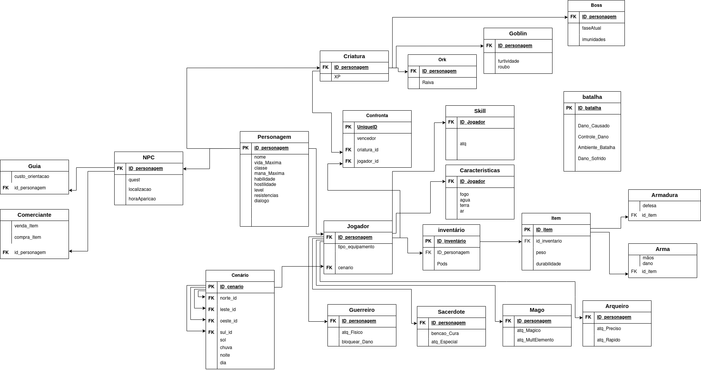

# Modelo Relacionamento
> O modelo relacional é um modelo de banco de dados que organiza os dados em tabelas (ou relações), formadas por linhas (registros) e colunas (atributos). Ele permite representar e manipular dados de forma simples, usando chaves primárias e estrangeiras para estabelecer relações entre as tabelas.

## Modelo Relacionamento - Senhor dos Aneis

  
Figura 1: DER Senhor dos Aneis

  
Fonte: Autores

# Tabela de Versionamento

| Versão | Data       | Descrição                                     | Autor(es)                                                             | Revisor(es)                                                          |
|--------|------------|-----------------------------------|-----------------------------------------------------------------------|----------------------------------------------------------------------|
|1.0  |02/04/2025     | Criação Docs Modelo Relacional | [Gabriel Esteves](https://github.com/GabrielMEsteves) e [Yan Luca Viana de Araújo Fontenele](https://github.com/yan-luca)|