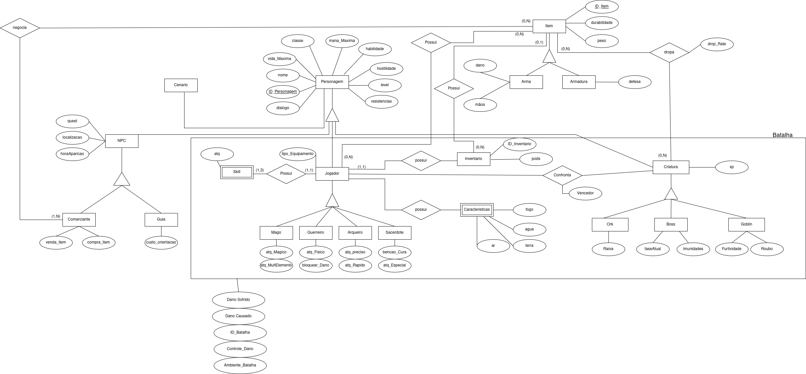
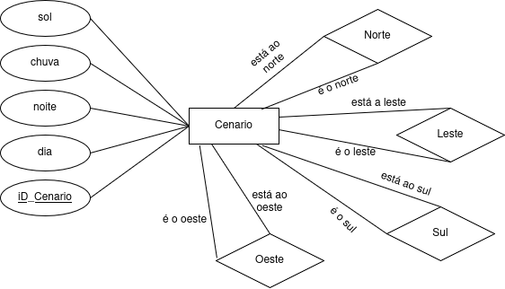

Versão 1.1

# Diagrama Entidade-Relacionamento (DER)

## O que é o Diagrama Entidade-Relacionamento?

> O Diagrama Entidade-Relacionamento (DER) representa as principais entidades do sistema e os relacionamentos entre elas. No contexto do jogo _Lord of The Rings_, esse diagrama ajuda a organizar e visualizar as informações que sustentam o funcionamento do jogo, servindo como base para a modelagem do banco de dados.
> Ele oferece uma visão lógica e abstrata da estrutura dos dados, facilitando o entendimento de como as informações estão organizadas e interligadas dentro do sistema. O DER é composto por elementos como entidades, atributos (incluindo chaves primárias), relacionamentos e restrições estruturais.

## Diagrama Entidade-Relacionamento do Projeto:

!!! Warning "Atenção!"
    O conteúdo deste tópico **poderá sofrer alterações** ao longo da Disciplina de Sistema de Banco de Dados 1. Portanto, os Diagramas Entidade-Relacionamento serão organizadas iniciando pela versão mais recente e finalizando com a versão mais antiga.

A seguir, está a imagem do diagrama de entidade-relacionamento desenvolvido para o jogo:

  DER | Versão 1.0

  
Figura 1: DER Lord of The Rings

  
Fonte: Autores

A seguir, está a imagem do diagrama de entidade-relacionamento desenvolvido para o mapa do jogo:

  DER Mapa| Versão 1.0

  
Figura 1: DER Mapa Lord of The Rings

  
Fonte: Autores

---

## Tabela de Versionamento

| Versão | Data       | Descrição                                     | Autor(es)                                                             | Revisor(es)                                                          |
|--------|------------|-----------------------------------|-----------------------------------------------------------------------|----------------------------------------------------------------------|
|1.0  |02/04/2025     | Criação Docs DER | [Gabriel Esteves](https://github.com/GabrielMEsteves) e [Yan Luca Viana de Araújo Fontenele](https://github.com/yan-luca)| [Felipe das Neves](https://github.com/FelipeFreire-gf) |
|1.1  |13/06/2025     | Atualização do Artefato | [Felipe das Neves](https://github.com/FelipeFreire-gf) | [Felipe das Neves](https://github.com/FelipeFreire-gf) |
